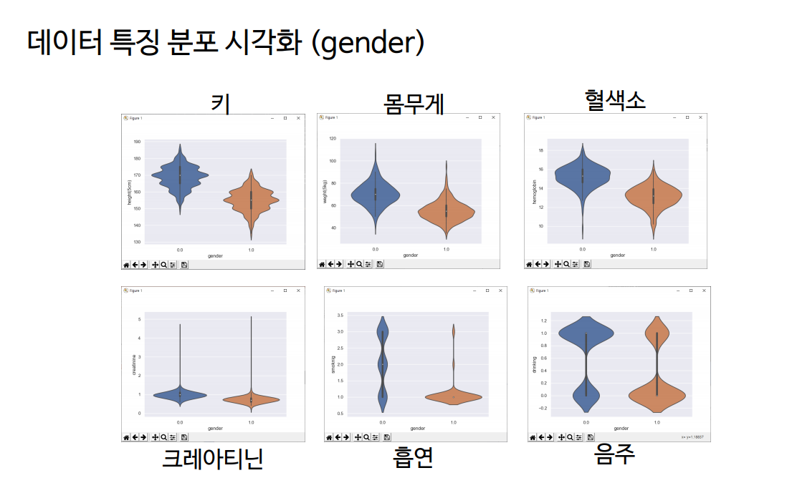
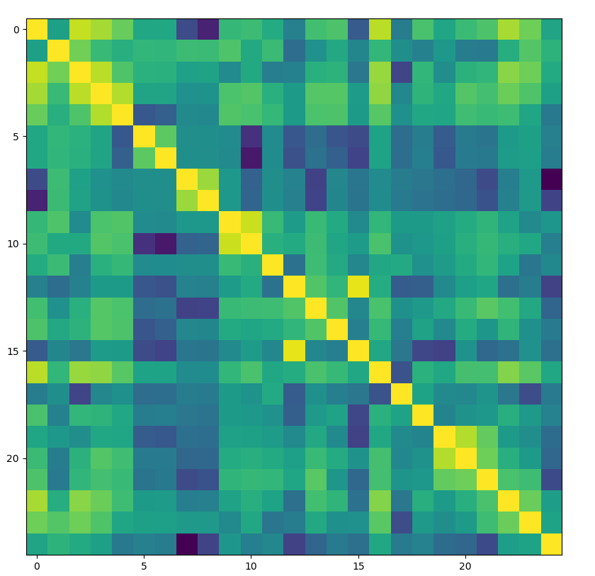
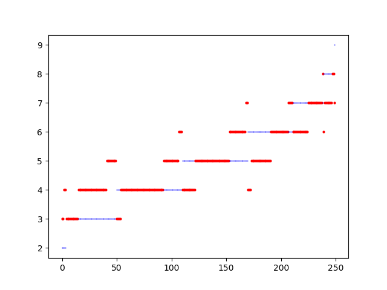
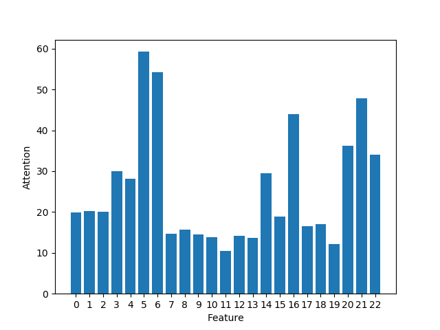

# 성별, 나이 분류 시스템 (건강검진 데이터)
----

1. Dataset 준비
 - 공공포털 건강검진 데이터
    - https://www.data.go.kr/data/15007122/fileData.do
    - 'NHIS_OPEN_GJ_2017.csv'를 source폴더에 저장
    - pip install -r requirement.txt
    - create_dataset.py 실행
    - **일련번호 끝자리가 5인 데이터를 Test Set으로 활용함

2. EDA 분석
 - statistical_anaysis.py를 편집하여 사용

3. 학습 및 결과
 - 나이 식별기 학습: python train.py age
 - 성별 식별기 학습: python train.py gender
 - 나이 식별기 테스트: python test.py age
 - 성별 식별기 테스트: python test.py gender

 4. 결과 미리보기

   
 - 바이올린 플롯을 통한 분석 시각화

    
 - 건강데이터 수치 간 상관계수 시각화

    
 - 테스트 결과 시각화

   
 - Attention 분석 시각화

5. 발표자료
 - <a href="presentation.pdf"> presentation.pdf </a>
